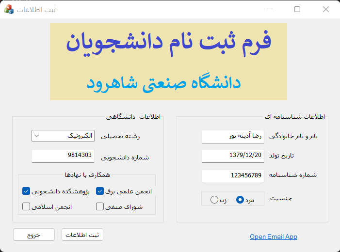
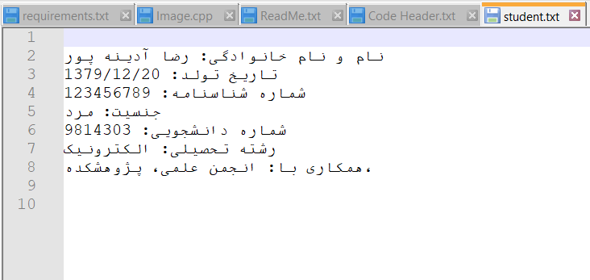

# Persian GUI Student Registration Program
In this application, which is written in C++ and MFC API, you can receive user registration information and save it in a txt file.

This application is written for Windows.

## TechStack/framework used
- C++
- [Microsoft Foundation Class](https://learn.microsoft.com/en-us/cpp/mfc/mfc-desktop-applications?view=msvc-170) (MFC)

## Installation
Create a dialogue based MFC application and add this files in your project.
  
## User Interface

## Result
The entered information is saved in <code>student.txt</code>.

## License
This project is licensed under the [MIT License](LICENSE).
